<div align="center">

# ♠️ Persona-Finance Twin Platform · Y.Mine

### Behavior Collection → Persona Mapping → Financial Narrative Generation

[](README-EN.md)
[](README.md)

[](LICENSE)
[](https://reactjs.org/)
[](https://fastapi.tiangolo.com/)
[](https://deepseek.com/)

**Every choice you make is shaping your financial persona.**

</div>

---

## 🧠 Project Philosophy · From Behavior to Persona to Finance

> Traditional financial products only care about "how much you made," while Y.Mine cares about "why you made that decision."

This project builds a **digital persona twin space**: it collects user decision data through diverse behavioral scenarios — Texas Hold'em, billiards, fitness, bartending, and more — then fuses multi-source information including Tarot archetypes, chakra energy, and music profiles to construct a six-dimensional persona vector model, ultimately generating personalized persona insight briefs and financial behavior analysis.

---

## 🏗️ System Architecture Panorama

```mermaid
%%{init: {'theme': 'dark', 'themeVariables': {
  'background': '#0a080c',
  'primaryColor': '#8a5a3b',
  'primaryBorderColor': '#8a5a3b',
  'primaryTextColor': '#d4c0a8',
  'secondaryColor': '#1a1420',
  'tertiaryColor': '#0e0b10',
  'lineColor': '#3a2a30'
}}}%%
graph TB
    classDef behavior fill:#1a1420,stroke:#b8860b,stroke-width:1.5px,color:#d4c0a8;
    classDef cognition fill:#0e0b10,stroke:#3b5e6b,stroke-width:1.5px,color:#8ab0b8;
    classDef finance fill:#0a080c,stroke:#5a8a5a,stroke-width:1.5px,color:#8aaa8a;
    classDef output fill:#1a1420,stroke:#b8860b,stroke-width:1.5px,color:#d4c0a8,stroke-dasharray:5 2;

    subgraph layer_behavior["🎮 Behavior Collection Layer"]
        B1[Texas Hold'em<br>Risk Preference]:::behavior
        B2[Billiards<br>Precision/Force]:::behavior
        B3[Fitness<br>Discipline/Execution]:::behavior
        B4[Bartending<br>Emotion/Narrative]:::behavior
        B5[Music<br>Emotional Tone]:::behavior
    end

    subgraph layer_cognition["🧠 Persona Cognition Layer"]
        C1[Cognitive Mapping<br>Tri-Circle Topology]:::cognition
        C2[Persona Mirror<br>MBTI/Big Five]:::cognition
        C3[Tarot Guidance<br>22 Major Arcana]:::cognition
        C4[Chakra Test<br>7 Chakra Energies]:::cognition
        C5[DNA Analysis<br>6D Gene Profile]:::cognition
    end

    subgraph layer_finance["💰 Financial Simulation Layer"]
        F1[Stock Simulator<br>32 Preset Pools]:::finance
        F2[Corporate Finance<br>Financial Modeling]:::finance
        F3[Information Funnel<br>Decision Weights]:::finance
        F4[Risk Stress<br>Stress Scenarios]:::finance
    end

    subgraph layer_output["📦 Output Layer"]
        O1[6D Radar Chart<br>ECharts Visualization]:::output
        O2[Persona Insight Brief<br>7 Archetypes]:::output
        O3[AI Narrative Generation<br>DeepSeek Powered]:::output
        O4[Investor Profiles<br>Image Library]:::output
    end

    B1 & B2 & B3 & B4 & B5 --> C1 & C2 & C3 & C4 & C5
    C1 & C2 & C3 & C4 & C5 --> F1 & F2 & F3 & F4
    F1 & F2 & F3 & F4 --> O1 & O2 & O3 & O4

    style layer_behavior fill:#0a080c,stroke:#b8860b,stroke-width:1px
    style layer_cognition fill:#0a080c,stroke:#3b5e6b,stroke-width:1px
    style layer_finance fill:#0a080c,stroke:#5a8a5a,stroke-width:1px
    style layer_output fill:#0a080c,stroke:#b8860b,stroke-width:1px
```



---

## 📊 Core Data Flow

```mermaid
%%{init: {'theme': 'dark', 'themeVariables': {
  'background': '#0a080c',
  'primaryColor': '#8a5a3b',
  'primaryBorderColor': '#8a5a3b',
  'primaryTextColor': '#d4c0a8',
  'secondaryColor': '#1a1420',
  'tertiaryColor': '#0e0b10',
  'lineColor': '#3a2a30'
}}}%%
graph TB
    subgraph layer_input["🎮 Behavior Input Layer"]
        I1[Texas Hold'em<br>Risk/Decision Speed]
        I2[Billiards<br>Aiming Precision/Force]
        I3[Fitness<br>Training Discipline/Intensity]
        I4[Bartending<br>Emotion/Narrative Preference]
        I5[Music Profile<br>Emotional Tone/Energy Level]
    end

    subgraph layer_storage["💾 Local Storage Layer"]
        S[(localStorage<br>ymine_sandbox_v1)]
    end

    subgraph layer_engine["⚙️ Cognitive Engine Layer"]
        E1[cognitiveCircleEngine.build]
        E2[Tarot Card Weight Injection]
        E3[Chakra Energy Mapping]
        E4[Multi-Source Fusion → 6D Vector]
    end

    subgraph layer_insight["📋 Insight Generation Layer"]
        L1[Persona Archetype Classification<br>7 Types]
        L2[Strength Dimension Analysis]
        L3[Risk Alerts]
        L4[Tarot Influence Tags]
        L5[Action Recommendations]
    end

    subgraph layer_output["📊 Rendering Output Layer"]
        O1[PersonaRadar Radar Chart]
        O2[Insight Brief Cards]
        O3[Cognitive Mapping Thumbnail]
        O4[Today's Tarot × Music Link]
    end

    I1 & I2 & I3 & I4 & I5 --> S
    S --> E1
    E1 --> E2 --> E3 --> E4
    E4 --> L1 & L2 & L3 & L4 & L5
    L1 & L2 & L3 & L4 & L5 --> O1 & O2 & O3 & O4

    style layer_input fill:#0a080c,stroke:#b8860b,stroke-width:1px
    style layer_storage fill:#0a080c,stroke:#5a8a5a,stroke-width:1px
    style layer_engine fill:#0a080c,stroke:#3b5e6b,stroke-width:1px
    style layer_insight fill:#0a080c,stroke:#8a5a3b,stroke-width:1px
    style layer_output fill:#0a080c,stroke:#b8860b,stroke-width:1px
```



---

## ✦ AI Narrative Layer Call Chain

> **Computation stays local, narrative goes to LLM** — all methodology computations (quantitative engine, cognitive mapping, investor matching) remain in the local engine for deterministic results; LLM is only responsible for narrative personalization.

```mermaid
%%{init: {'theme': 'dark', 'themeVariables': {
  'background': '#0a080c',
  'primaryColor': '#4a6cf7',
  'primaryBorderColor': '#4a6cf7',
  'primaryTextColor': '#d4c0a8',
  'secondaryColor': '#1a1420',
  'tertiaryColor': '#0e0b10',
  'lineColor': '#3a2a30'
}}}%%
graph LR
    subgraph layer_frontend["🖥️ Frontend"]
        F[User clicks AI feature button]
    end

    subgraph layer_gateway["🚪 API Gateway Layer"]
        G[JWT Verification]
        T[Template Registry<br>9 Whitelisted Templates]
    end

    subgraph layer_service["⚙️ Server Side"]
        P[Parameter Whitelist<br>200 chars/item]
        H[Guardrails<br>max_tokens + temperature 0.8]
    end

    subgraph layer_llm["🧠 LLM Layer"]
        L[DeepSeek API<br>Key held server-side only]
    end

    subgraph layer_response["📦 Response Layer"]
        R[Narrative Text Generation]
        D[Not logged in → local template fallback]
    end

    F --> G
    G -->|Logged in| T
    G -->|Not logged in| D
    T --> P --> H --> L
    L --> R
    D --> R

    style layer_frontend fill:#0a080c,stroke:#b8860b,stroke-width:1px
    style layer_gateway fill:#0a080c,stroke:#3b5e6b,stroke-width:1px
    style layer_service fill:#0a080c,stroke:#5a8a5a,stroke-width:1px
    style layer_llm fill:#0a080c,stroke:#4a6cf7,stroke-width:1px
    style layer_response fill:#0a080c,stroke:#b8860b,stroke-width:1px
```



---

## 🧭 Route Architecture Panorama

```mermaid
%%{init: {'theme': 'dark', 'themeVariables': {
  'background': '#0a080c',
  'primaryColor': '#8a5a3b',
  'primaryBorderColor': '#8a5a3b',
  'primaryTextColor': '#d4c0a8',
  'secondaryColor': '#1a1420',
  'tertiaryColor': '#0e0b10',
  'lineColor': '#3a2a30'
}}}%%
graph TB
    subgraph core["🏠 Core Entry"]
        D["/dashboard Home"]
    end

    subgraph behavior["🎮 Behavior Collection"]
        P["/poker Texas Hold'em"]
        B["/billiards Billiards"]
        F["/fitness Fitness"]
        M["/music K-Line Music"]
        BT["/bartender Bartending"]
        GT["/game-table Game Table"]
    end

    subgraph cognition["🧠 Persona Cognition"]
        PSY["/psychology Cognitive Mapping"]
        PM["/persona-mirror Persona Mirror"]
        G["/genome DNA Analysis"]
        MS["/mindspeak MindSpeak"]
        T["/tarot Tarot Guidance"]
        CH["/chakra Chakra Test"]
        V["/vector Vector Analysis"]
        R["/risk Risk Stress"]
        CP["/cultivation-plan Cultivation Plan"]
    end

    subgraph finance["💰 Financial Simulation"]
        S["/stock Stock Simulator"]
        FIN["/finance Corporate Finance"]
        FU["/funnel Information Funnel"]
        A["/archive Investor Archive"]
    end

    subgraph output["📦 Output & Extension"]
        CHUB["/content-hub Content Hub"]
        GE["/game-engine Game Engine"]
        RO["/robot Humanoid Robot"]
        DD["/drone-dispatch Drone Dispatch"]
        CO["/cockpit Cockpit"]
    end

    D --> P
    D --> B
    D --> F
    D --> M
    D --> BT
    D --> GT
    D --> PSY
    D --> PM
    D --> G
    D --> MS
    D --> T
    D --> CH
    D --> V
    D --> R
    D --> CP
    D --> S
    D --> FIN
    D --> FU
    D --> A
    D --> CHUB
    D --> GE
    D --> RO
    D --> DD
    D --> CO

    style core fill:#0a080c,stroke:#b8860b,stroke-width:1px
    style behavior fill:#0a080c,stroke:#b8860b,stroke-width:1px
    style cognition fill:#0a080c,stroke:#3b5e6b,stroke-width:1px
    style finance fill:#0a080c,stroke:#5a8a5a,stroke-width:1px
    style output fill:#0a080c,stroke:#8a5a3b,stroke-width:1px
```



---

## ✨ Core Feature Matrix

### 🎮 Behavior Collection Layer

| Module | Route | Core Function |
| :--- | :--- | :--- |
| 🃏 Texas Hold'em | `/poker` | Full game flow + Kelly Formula + risk preference analysis |
| 🎱 Billiards | `/billiards` | Aiming angle/force/decision speed behavior collection |
| 💪 Fitness | `/fitness` | Training discipline/intensity deviation/plan execution tracking |
| 🎵 K-Line Music | `/music` | AudioContext synthesis + emotion matching + NetEase Cloud integration |
| 🍸 Molecular Bartending | `/bartender` | Narrative tone + emotion mapping + MBTI persona recipe |
| ♟️ Simulation Game Table | `/game-table` | Multi-persona AI vs AI strategy simulation |

### 🧠 Persona Cognition Layer

| Module | Route | Core Function |
| :--- | :--- | :--- |
| 🌀 Cognitive Mapping | `/psychology` | Tri-circle topology + node relationships + resultant force calculation |
| 👁️ Persona Mirror | `/persona-mirror` | MBTI/Big Five mapping + behavioral preference analysis |
| 🧬 DNA Analysis | `/genome` | 6D capability gene profile + historical tracking |
| 💡 MindSpeak | `/mindspeak` | Thought stream tracking + cognitive pattern recognition (11 modules + 3-model audit) |
| 🃏 Tarot Guidance | `/tarot` | 22 Major Arcana + persona dimension influence |
| 🔄 Chakra Test | `/chakra` | 7 chakra energy test + behavior dimension mapping |
| 📈 Vector Analysis | `/vector` | 6D vector precision calculation + trend analysis |
| ⚠️ Risk Stress | `/risk` | Risk preference test + stress scenario simulation |
| 🌱 Cultivation Plan | `/cultivation-plan` | Personalized growth path based on capability gaps |

### 💰 Financial Simulation Layer

| Module | Route | Core Function |
| :--- | :--- | :--- |
| 📊 Stock Simulator | `/stock` | 32 preset pools + East Money real-time quotes + K-line chart + CSV export |
| 🏢 Corporate Finance | `/finance` | Financial modeling + financing simulation |
| 🔻 Information Funnel | `/funnel` | Multi-source information filtering + decision weighting |
| 📁 Investor Archive | `/archive` | Investor/entrepreneur profile library |

### ✦ AI Narrative Layer (DeepSeek Powered)

| AI Capability | Mount Point | Trigger |
| :--- | :--- | :--- |
| 🃏 AI Resident Tarot Reader + Daily Action Guide | Tarot `/tarot` | Auto-triggered on card draw |
| 🏦 AI Investment Persona Interpretation | IB Dashboard `/ib-dashboard` | Button trigger |
| 📋 Persona-Finance Comprehensive Report | Home `/dashboard` | Button trigger |
| 🌱 Growth Coach Message | Cultivation Plan `/cultivation-plan` | Button trigger |
| 🧠 AI Persona Brief | Cognitive Mapping `/psychology` | Button trigger |
| 🍸 Host Review | MBTI Entrepreneur Cocktail | Button trigger |
| 🚁 AI Dispatch Broadcast | Drone Dispatch `/drone-dispatch` | Button trigger |
| 🤖 AI Real-time Conversation | Humanoid Robot `/robot` | Free-form chat input |

---

## 🛠️ Technology Stack

### Frontend

| Technology | Version | Purpose |
| :--- | :--- | :--- |
| React | 18 | UI Framework |
| Vite | 5 | Build Tool |
| React Router | 6 | Routing |
| Ant Design | 5 | UI Components |
| Zustand | 4 | State Management |
| ECharts | 6 | Data Visualization (Radar/K-line) |
| Three.js | 0.185 | 3D Molecular Rendering |
| Framer Motion | 10 | Animations |
| Axios | 1.6 | HTTP Client |

### Backend

| Technology | Purpose |
| :--- | :--- |
| FastAPI | Web Framework |
| WebSocket | Real-time Communication |
| SQLAlchemy | ORM |
| PostgreSQL | Database |
| Redis | Cache |
| scikit-learn | AI/ML Engine |
| JWT + bcrypt | Authentication / Password Hashing |
| DeepSeek API | LLM Narrative Layer |
| East Money + Sina + Tencent | Real-time Market Data Multi-Source Fallback |

### Infrastructure

| Technology | Purpose |
| :--- | :--- |
| Docker + Docker Compose | Containerized Deployment |
| Nginx | Reverse Proxy + Static Files |
| GitHub Actions | CI/CD |
| GitHub Pages | Frontend Static Hosting |
| Railway | Backend Hosting |

---

## 🏗️ Project Structure

```
poker-egg-fullstack/
├── frontend/
│   ├── src/
│   │   ├── components/      # Reusable Components (30+)
│   │   ├── pages/           # Page Components (30+)
│   │   ├── store/           # Zustand State Management
│   │   ├── utils/           # Business Engines (40+)
│   │   │   ├── cognitiveCircleEngine.js
│   │   │   ├── insightBriefEngine.js
│   │   │   ├── quantEngine.js
│   │   │   └── ...
│   │   ├── styles/
│   │   └── App.jsx
│   ├── vite.config.js
│   └── package.json
├── backend/
│   ├── app.py               # FastAPI Main Application
│   ├── ai/ai_engine.py      # AI Decision Engine
│   ├── auth/auth.py         # JWT Authentication
│   ├── models/              # Data Models
│   └── services/            # Business Services
├── netease-api/             # NetEase Cloud Music API
├── nginx/
├── docker-compose.yml
└── .github/workflows/deploy.yml
```

---

## 🚀 Quick Start

### Docker Deployment (Recommended)

```bash
git clone https://github.com/HelloMind-star/poker-egg-fullstack.git
cd poker-egg-fullstack
docker-compose up -d

# Access
# Frontend: http://localhost:5173
# Backend: http://localhost:5000
# API Docs: http://localhost:5000/docs
```

### Local Development

```bash
# Backend
cd backend
pip install -r requirements.txt
uvicorn app:app --reload --port 5000

# Frontend (new terminal)
cd frontend
npm install
npm run dev

# NetEase Cloud Music API (optional)
cd netease-api
npm install
node server.js
```

Visit `http://localhost:5173` — it will auto-redirect to `/dashboard`.

> 💡 Note: If PostgreSQL and Redis are not available, the backend will automatically fall back to in-memory mode.

---

## 👨‍💻 Developer Capability Map (Interview-Focused)

| Enterprise Capability | Project Module | Specific Manifestation |
| :--- | :--- | :--- |
| **Full-Stack Architecture** | React + FastAPI + Docker | Independent full-stack separation, containerized deployment, CI/CD pipeline |
| **Domain Modeling (DDD)** | Behavior → Cognition → Finance 3-layer mapping | Abstract unstructured behavior into 6D persona vector model |
| **Data Visualization** | ECharts Radar + K-line + Cognitive Topology | Multi-dimensional interactive chart design |
| **AI Productization** | DeepSeek Narrative Layer + Prompt Registry | Encapsulate LLM as productizable AI capability matrix |
| **Financial Engineering** | Stock Simulation + Kelly Formula + Risk Stress | Quantitative modeling and financial behavior analysis engineering |
| **UX Design** | 30+ pages + Unified sidebar navigation | Complete B-end/C-end product interaction design |

---

## 📋 Development Roadmap

### ✅ Completed

- **P0** — Core Data Pipeline: localStorage dual-track storage, cognitiveCircleEngine multi-source fusion, music data pathway
- **P1** — Immersion Upgrade: 6D Radar Chart, Persona Insight Brief, Tarot × Cognition integration, Chakra × Behavior mapping
- **P2** — Navigation & Layout: Flattened routing, Dashboard as main entry, mobile responsive adaptation
- **✦ LLM Narrative Layer** — User registration/login system, 9 AI capabilities fully lit, Stock Lab expansion (32 preset pools)

### 🔲 To Be Developed

- **P2** — Experience Polishing: Mobile navigation folding, ToolsPage expansion, ContentHub categorization
- **P3** — Data Depth: Backend persistence, cross-device sync, AI personalized recommendations
- **P4** — Mobile App: PWA transformation, offline mode, native app packaging

---

## 🤝 Contributing

1. Fork this repository
2. Create a feature branch (`git checkout -b feature/AmazingFeature`)
3. Commit your changes (`git commit -m 'Add some AmazingFeature'`)
4. Push to the branch (`git push origin feature/AmazingFeature`)
5. Open a Pull Request

---

## 📄 License

This project is licensed under the MIT License — see the [LICENSE](LICENSE) file for details.

---

## 👨‍💻 Author

**HelloMind-star (Mine)**

GitHub: [@HelloMind-star](https://github.com/HelloMind-star)

---

<div align="center">
  <sub>⚡ Every choice you make is shaping your financial persona ⚡</sub>
  <br>
  <sub>「 Behavior Collection → Persona Mapping → Financial Narrative 」</sub>
</div>


