<div align="center">

# ♠️ 人格金融孪生平台 · Y.Mine

### 行为采集 → 人格映射 → 金融叙事生成

[](README-EN.md)
[](README.md)

[](LICENSE)
[](https://reactjs.org/)
[](https://fastapi.tiangolo.com/)
[](https://deepseek.com/)

**每一次选择，都在塑造你的金融人格。**

</div>

---

## 🧠 项目哲学 · 从行为到人格到金融

> 传统金融产品只关心“你赚了多少”，而 Y.Mine 关心“你为什么这样决策”。

本项目构建了一个**人格数字孪生空间**：通过德州扑克、台球、健身、调酒等多种行为场景采集用户决策数据，融合塔罗、脉轮、音乐画像等多源信息，构建六维人格向量模型，最终生成个性化的人格洞察简报和金融行为分析。

---

## 🏗️ 系统架构全景图

```mermaid
%%{init: {'theme': 'dark', 'themeVariables': {
  'background': '#0a080c',
  'primaryColor': '#8a5a3b',
  'primaryBorderColor': '#8a5a3b',
  'primaryTextColor': '#d4c0a8',
  'secondaryColor': '#1a1420',
  'tertiaryColor': '#0e0b10',
  'lineColor': '#3a2a30'
}}}%%
graph TB
    classDef behavior fill:#1a1420,stroke:#b8860b,stroke-width:1.5px,color:#d4c0a8;
    classDef cognition fill:#0e0b10,stroke:#3b5e6b,stroke-width:1.5px,color:#8ab0b8;
    classDef finance fill:#0a080c,stroke:#5a8a5a,stroke-width:1.5px,color:#8aaa8a;
    classDef output fill:#1a1420,stroke:#b8860b,stroke-width:1.5px,color:#d4c0a8,stroke-dasharray:5 2;

    subgraph layer_behavior["🎮 行为采集层"]
        B1[德州扑克<br>风险偏好]:::behavior
        B2[台球<br>精度/力度]:::behavior
        B3[健身<br>纪律/执行力]:::behavior
        B4[调酒<br>情绪/叙事]:::behavior
        B5[音乐<br>情绪基调]:::behavior
    end

    subgraph layer_cognition["🧠 人格认知层"]
        C1[认知画圈<br>三环拓扑]:::cognition
        C2[人格镜子<br>MBTI/大五]:::cognition
        C3[塔罗指引<br>22大阿尔卡那]:::cognition
        C4[脉轮测试<br>7脉轮能量]:::cognition
        C5[DNA分析<br>六维基因]:::cognition
    end

    subgraph layer_finance["💰 金融模拟层"]
        F1[股价模拟<br>32只预设池]:::finance
        F2[公司理财<br>财务建模]:::finance
        F3[信息漏斗<br>决策权重]:::finance
        F4[风险压力<br>压力场景]:::finance
    end

    subgraph layer_output["📦 输出层"]
        O1[六维雷达图<br>ECharts可视化]:::output
        O2[人格洞察简报<br>7种原型]:::output
        O3[AI叙事生成<br>DeepSeek点亮]:::output
        O4[投资人档案<br>画像库]:::output
    end

    B1 & B2 & B3 & B4 & B5 --> C1 & C2 & C3 & C4 & C5
    C1 & C2 & C3 & C4 & C5 --> F1 & F2 & F3 & F4
    F1 & F2 & F3 & F4 --> O1 & O2 & O3 & O4

    style layer_behavior fill:#0a080c,stroke:#b8860b,stroke-width:1px
    style layer_cognition fill:#0a080c,stroke:#3b5e6b,stroke-width:1px
    style layer_finance fill:#0a080c,stroke:#5a8a5a,stroke-width:1px
    style layer_output fill:#0a080c,stroke:#b8860b,stroke-width:1px
```



---

## 📊 核心数据流

```mermaid
%%{init: {'theme': 'dark', 'themeVariables': {
  'background': '#0a080c',
  'primaryColor': '#8a5a3b',
  'primaryBorderColor': '#8a5a3b',
  'primaryTextColor': '#d4c0a8',
  'secondaryColor': '#1a1420',
  'tertiaryColor': '#0e0b10',
  'lineColor': '#3a2a30'
}}}%%
graph TB
    subgraph layer_input["🎮 行为输入层"]
        I1[德州扑克<br>风险偏好/决策速度]
        I2[台球<br>瞄准精度/力度控制]
        I3[健身<br>训练纪律/强度偏差]
        I4[调酒<br>情绪状态/叙事偏好]
        I5[音乐画像<br>情绪基调/能量水平]
    end

    subgraph layer_storage["💾 本地存储层"]
        S[(localStorage<br>ymine_sandbox_v1)]
    end

    subgraph layer_engine["⚙️ 认知引擎层"]
        E1[cognitiveCircleEngine.build]
        E2[塔罗牌义权重注入]
        E3[脉轮能量映射]
        E4[多源融合 → 六维向量]
    end

    subgraph layer_insight["📋 洞察生成层"]
        L1[人格原型分类<br>7种原型]
        L2[优势维度分析]
        L3[风险提示]
        L4[塔罗影响标签]
        L5[行动建议]
    end

    subgraph layer_output["📊 渲染输出层"]
        O1[PersonaRadar 雷达图]
        O2[洞察简报卡片]
        O3[认知画圈缩略图]
        O4[今日塔罗 × 音乐联动]
    end

    I1 & I2 & I3 & I4 & I5 --> S
    S --> E1
    E1 --> E2 --> E3 --> E4
    E4 --> L1 & L2 & L3 & L4 & L5
    L1 & L2 & L3 & L4 & L5 --> O1 & O2 & O3 & O4

    style layer_input fill:#0a080c,stroke:#b8860b,stroke-width:1px
    style layer_storage fill:#0a080c,stroke:#5a8a5a,stroke-width:1px
    style layer_engine fill:#0a080c,stroke:#3b5e6b,stroke-width:1px
    style layer_insight fill:#0a080c,stroke:#8a5a3b,stroke-width:1px
    style layer_output fill:#0a080c,stroke:#b8860b,stroke-width:1px
```



---

## ✦ AI 叙事层调用链路

> **算留本地，说换 LLM** —— 方法论计算在本地引擎完成，LLM 只负责叙事个性化。

```mermaid
%%{init: {'theme': 'dark', 'themeVariables': {
  'background': '#0a080c',
  'primaryColor': '#4a6cf7',
  'primaryBorderColor': '#4a6cf7',
  'primaryTextColor': '#d4c0a8',
  'secondaryColor': '#1a1420',
  'tertiaryColor': '#0e0b10',
  'lineColor': '#3a2a30'
}}}%%
graph LR
    subgraph layer_frontend["🖥️ 前端"]
        F[用户点击 AI 功能按钮]
    end

    subgraph layer_gateway["🚪 API 网关层"]
        G[JWT 验证]
        T[模板注册表<br>9条白名单模板]
    end

    subgraph layer_service["⚙️ 服务端"]
        P[参数白名单<br>200字符/项]
        H[护栏检查<br>max_tokens + temperature 0.8]
    end

    subgraph layer_llm["🧠 LLM 层"]
        L[DeepSeek API<br>仅服务端持有 Key]
    end

    subgraph layer_response["📦 响应层"]
        R[叙事文本生成]
        D[未登录 → 本地模板兜底]
    end

    F --> G
    G -->|已登录| T
    G -->|未登录| D
    T --> P --> H --> L
    L --> R
    D --> R

    style layer_frontend fill:#0a080c,stroke:#b8860b,stroke-width:1px
    style layer_gateway fill:#0a080c,stroke:#3b5e6b,stroke-width:1px
    style layer_service fill:#0a080c,stroke:#5a8a5a,stroke-width:1px
    style layer_llm fill:#0a080c,stroke:#4a6cf7,stroke-width:1px
    style layer_response fill:#0a080c,stroke:#b8860b,stroke-width:1px
```



---

## 🧭 路由架构全景

```mermaid
%%{init: {'theme': 'dark', 'themeVariables': {
  'background': '#0a080c',
  'primaryColor': '#8a5a3b',
  'primaryBorderColor': '#8a5a3b',
  'primaryTextColor': '#d4c0a8',
  'secondaryColor': '#1a1420',
  'tertiaryColor': '#0e0b10',
  'lineColor': '#3a2a30'
}}}%%
graph TB
    subgraph core["🏠 核心入口"]
        D["/dashboard 工作台首页"]
    end

    subgraph behavior["🎮 行为采集"]
        P["/poker 德州扑克"]
        B["/billiards 台球"]
        F["/fitness 健身"]
        M["/music K线音乐"]
        BT["/bartender 调酒"]
        GT["/game-table 博弈台"]
    end

    subgraph cognition["🧠 人格认知"]
        PSY["/psychology 认知画圈"]
        PM["/persona-mirror 人格镜子"]
        G["/genome DNA分析"]
        MS["/mindspeak 思维流"]
        T["/tarot 塔罗指引"]
        CH["/chakra 脉轮测试"]
        V["/vector 向量分析"]
        R["/risk 风险压力"]
        CP["/cultivation-plan 培养方案"]
    end

    subgraph finance["💰 金融模拟"]
        S["/stock 股价模拟"]
        FIN["/finance 公司理财"]
        FU["/funnel 信息漏斗"]
        A["/archive 投资人档案"]
    end

    subgraph output["📦 输出与扩展"]
        CHUB["/content-hub 内容中枢"]
        GE["/game-engine 游戏引擎"]
        RO["/robot 人形机器人"]
        DD["/drone-dispatch 无人机调度"]
        CO["/cockpit 驾驶舱"]
    end

    D --> P
    D --> B
    D --> F
    D --> M
    D --> BT
    D --> GT
    D --> PSY
    D --> PM
    D --> G
    D --> MS
    D --> T
    D --> CH
    D --> V
    D --> R
    D --> CP
    D --> S
    D --> FIN
    D --> FU
    D --> A
    D --> CHUB
    D --> GE
    D --> RO
    D --> DD
    D --> CO

    style core fill:#0a080c,stroke:#b8860b,stroke-width:1px
    style behavior fill:#0a080c,stroke:#b8860b,stroke-width:1px
    style cognition fill:#0a080c,stroke:#3b5e6b,stroke-width:1px
    style finance fill:#0a080c,stroke:#5a8a5a,stroke-width:1px
    style output fill:#0a080c,stroke:#8a5a3b,stroke-width:1px
```



---

## ✨ 核心功能矩阵

### 🎮 行为采集层

| 模块 | 路由 | 核心功能 |
| :--- | :--- | :--- |
| 🃏 德州扑克 | `/poker` | 完整对局流程 + 凯利公式 + 风险偏好分析 |
| 🎱 台球 | `/billiards` | 瞄准角度/力度/决策速度的行为采集 |
| 💪 健身 | `/fitness` | 训练纪律/强度偏差/计划执行力追踪 |
| 🎵 K线音乐 | `/music` | AudioContext 音频合成 + 情绪匹配 + 网易云接入 |
| 🍸 分子调酒 | `/bartender` | 叙事基调 + 情绪映射 + MBTI 人格配方 |
| ♟️ 模拟博弈台 | `/game-table` | 多人格 AI 对弈 + 策略推演 |

### 🧠 人格认知层

| 模块 | 路由 | 核心功能 |
| :--- | :--- | :--- |
| 🌀 认知画圈 | `/psychology` | 三环拓扑图 + 节点关系 + 合力计算 |
| 👁️ 人格镜子 | `/persona-mirror` | MBTI/大五人格映射 + 行为偏好分析 |
| 🧬 DNA 分析 | `/genome` | 六维能力基因图谱 + 历史追踪 |
| 💡 MindSpeak | `/mindspeak` | 思维流追踪 + 认知模式识别（11模块+三模型审计） |
| 🃏 塔罗指引 | `/tarot` | 22张大阿尔卡那 + 人格维度影响 |
| 🔄 脉轮测试 | `/chakra` | 7脉轮能量测试 + 行为维度映射 |
| 📈 向量分析 | `/vector` | 六维向量精算 + 趋势分析 |
| ⚠️ 风险压力 | `/risk` | 风险偏好测试 + 压力场景模拟 |
| 🌱 培养方案 | `/cultivation-plan` | 基于能力短板的个性化成长路径 |

### 💰 金融模拟层

| 模块 | 路由 | 核心功能 |
| :--- | :--- | :--- |
| 📊 股价模拟 | `/stock` | 32只预设池 + 东方财富实时行情 + K线图 + CSV导出 |
| 🏢 公司理财 | `/finance` | 财务建模 + 融资模拟 |
| 🔻 信息漏斗 | `/funnel` | 多源信息过滤 + 决策权重 |
| 📁 投资人档案 | `/archive` | 投资人/企业家画像库 |

### ✦ AI 叙事层（DeepSeek 点亮）

| AI 能力 | 挂载点 | 触发方式 |
| :--- | :--- | :--- |
| 🃏 AI 驻馆解牌师 + 今日行动指引 | 塔罗指引 `/tarot` | 抽牌揭晓自动调用 |
| 🏦 AI 投资人格解读 | 投行看板 `/ib-dashboard` | 按钮触发 |
| 📋 人格金融综合报告 | 工作台首页 `/dashboard` | 按钮触发 |
| 🌱 成长教练寄语 | 培养方案 `/cultivation-plan` | 按钮触发 |
| 🧠 AI 人格简报 | 认知画圈 `/psychology` | 按钮触发 |
| 🍸 主理人回顾 | MBTI 企业家酒局 | 按钮触发 |
| 🚁 AI 调度播报 | 无人机调度 `/drone-dispatch` | 按钮触发 |
| 🤖 AI 实时对话 | 人形机器人 `/robot` | 输入框自由对话 |

---

## 🛠️ 技术栈

### 前端

| 技术 | 版本 | 用途 |
| :--- | :--- | :--- |
| React | 18 | UI 框架 |
| Vite | 5 | 构建工具 |
| React Router | 6 | 路由管理 |
| Ant Design | 5 | UI 组件库 |
| Zustand | 4 | 状态管理 |
| ECharts | 6 | 数据可视化（雷达图/K线图） |
| Three.js | 0.185 | 3D 分子渲染 |
| Framer Motion | 10 | 动画效果 |
| Axios | 1.6 | HTTP 请求 |

### 后端

| 技术 | 用途 |
| :--- | :--- |
| FastAPI | Web 框架 |
| WebSocket | 实时通信 |
| SQLAlchemy | ORM |
| PostgreSQL | 数据库 |
| Redis | 缓存 |
| scikit-learn | AI/ML 引擎 |
| JWT + bcrypt | 用户认证/密码哈希 |
| DeepSeek API | LLM 叙事层 |
| 东方财富 + 新浪 + 腾讯 | 实时行情多源合并兜底 |

### 基础设施

| 技术 | 用途 |
| :--- | :--- |
| Docker + Docker Compose | 容器化部署 |
| Nginx | 反向代理 + 静态文件 |
| GitHub Actions | CI/CD |
| GitHub Pages | 前端静态部署 |
| Railway | 后端部署 |

---

## 🏗️ 项目结构

```
poker-egg-fullstack/
├── frontend/
│   ├── src/
│   │   ├── components/      # 可复用组件（30+）
│   │   ├── pages/           # 页面组件（30+）
│   │   ├── store/           # Zustand 状态管理
│   │   ├── utils/           # 业务引擎（40+）
│   │   │   ├── cognitiveCircleEngine.js
│   │   │   ├── insightBriefEngine.js
│   │   │   ├── quantEngine.js
│   │   │   └── ...
│   │   ├── styles/
│   │   └── App.jsx
│   ├── vite.config.js
│   └── package.json
├── backend/
│   ├── app.py               # FastAPI 主应用
│   ├── ai/ai_engine.py      # AI 决策引擎
│   ├── auth/auth.py         # JWT 认证
│   ├── models/              # 数据模型
│   └── services/            # 业务服务
├── netease-api/             # 网易云音乐 API
├── nginx/
├── docker-compose.yml
└── .github/workflows/deploy.yml
```

---

## 🚀 快速开始

### Docker 部署（推荐）

```bash
git clone https://github.com/HelloMind-star/poker-egg-fullstack.git
cd poker-egg-fullstack
docker-compose up -d

# 访问
# 前端: http://localhost:5173
# 后端: http://localhost:5000
# API 文档: http://localhost:5000/docs
```

### 本地开发

```bash
# 后端
cd backend
pip install -r requirements.txt
uvicorn app:app --reload --port 5000

# 前端（新终端）
cd frontend
npm install
npm run dev

# 网易云音乐 API（可选）
cd netease-api
npm install
node server.js
```

访问 `http://localhost:5173`，自动跳转到工作台 `/dashboard`。

> 💡 提示：如果没有 PostgreSQL 和 Redis，后端自动降级为内存模式。

---

## 👨‍💻 开发者能力图谱（面试向）

| 企业能力 | 本项目对应模块 | 具体体现 |
| :--- | :--- | :--- |
| **全栈架构设计** | React + FastAPI + Docker | 独立完成前后端分离、容器化部署、CI/CD 全链路 |
| **领域建模 (DDD)** | 行为采集 → 人格认知 → 金融模拟 三层映射 | 将非结构化的用户行为抽象为六维人格向量模型 |
| **数据可视化** | ECharts 雷达图 + K线图 + 认知画圈拓扑 | 多维度数据可视化，交互式图表设计 |
| **AI 产品化** | DeepSeek 叙事层 + Prompt 模板注册表 | 将 LLM 封装为可产品化的 AI 能力矩阵 |
| **金融工程** | 股价模拟 + 凯利公式 + 风险压力测试 | 量化模型与金融行为分析的工程落地 |
| **用户体验设计** | 30+ 页面 + 统一侧边栏导航 | 完整的 B 端/C 端产品交互设计 |

---

## 📋 开发计划

### ✅ 已完成

- **P0** — 核心数据通路：localStorage 双轨存储、cognitiveCircleEngine 多源融合、音乐数据通路
- **P1** — 沉浸感升级：六维雷达图、人格洞察简报、塔罗×认知联动、脉轮×行为数据映射
- **P2** — 导航与布局：路由扁平化、Dashboard 主入口、移动端响应式适配
- **✦ LLM 叙事层点亮**：用户注册/登录系统、9 大 AI 能力全站点亮、行情实验室扩容（32只预设池）

### 🔲 待开发

- **P2** — 体验打磨：全局导航移动端折叠、ToolsPage 功能扩充、ContentHub 分类导航
- **P3** — 数据深度：后端数据持久化、跨设备同步、AI 个性化推荐
- **P4** — 移动端 APP：PWA 改造、离线模式、原生 APP 封装

---

## 🤝 贡献指南

1. Fork 本仓库
2. 创建特性分支 (`git checkout -b feature/AmazingFeature`)
3. 提交更改 (`git commit -m 'Add some AmazingFeature'`)
4. 推送到分支 (`git push origin feature/AmazingFeature`)
5. 开启 Pull Request

---

## 📄 开源协议

本项目采用 MIT 协议 — 详见 LICENSE 文件

---

## 👨‍💻 作者

**HelloMind-star (Mine)**

GitHub: [@HelloMind-star](https://github.com/HelloMind-star)

---

<div align="center">
  <sub>⚡ 每一次选择，都在塑造你的金融人格 ⚡</sub>
  <br>
  <sub>「 行为采集 → 人格映射 → 金融叙事 」</sub>
</div>


