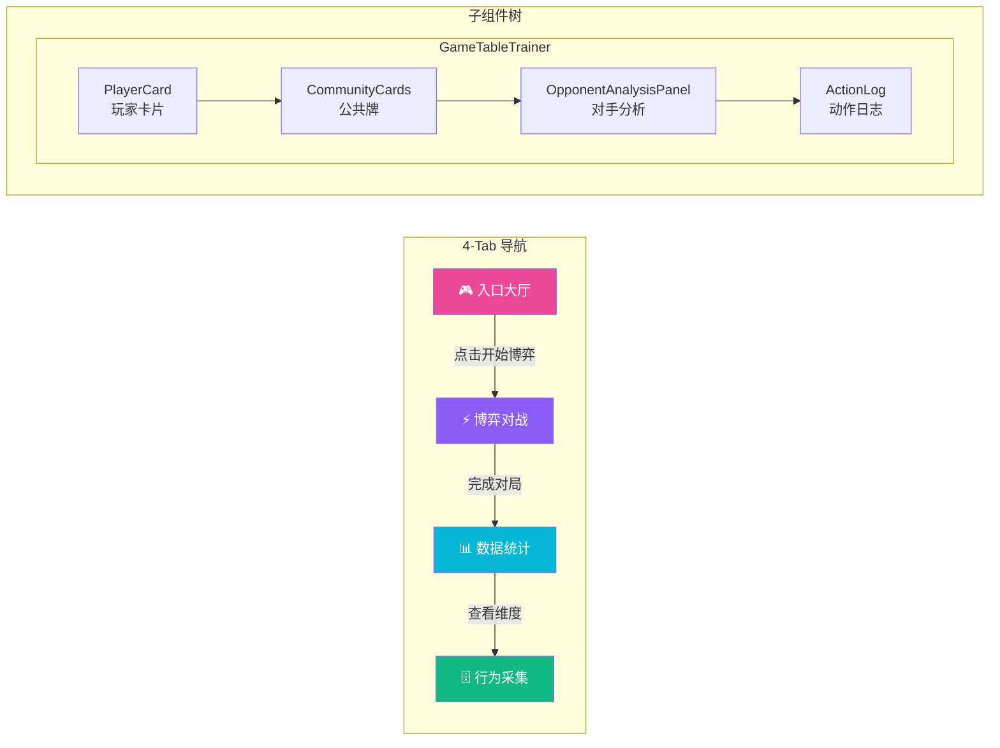
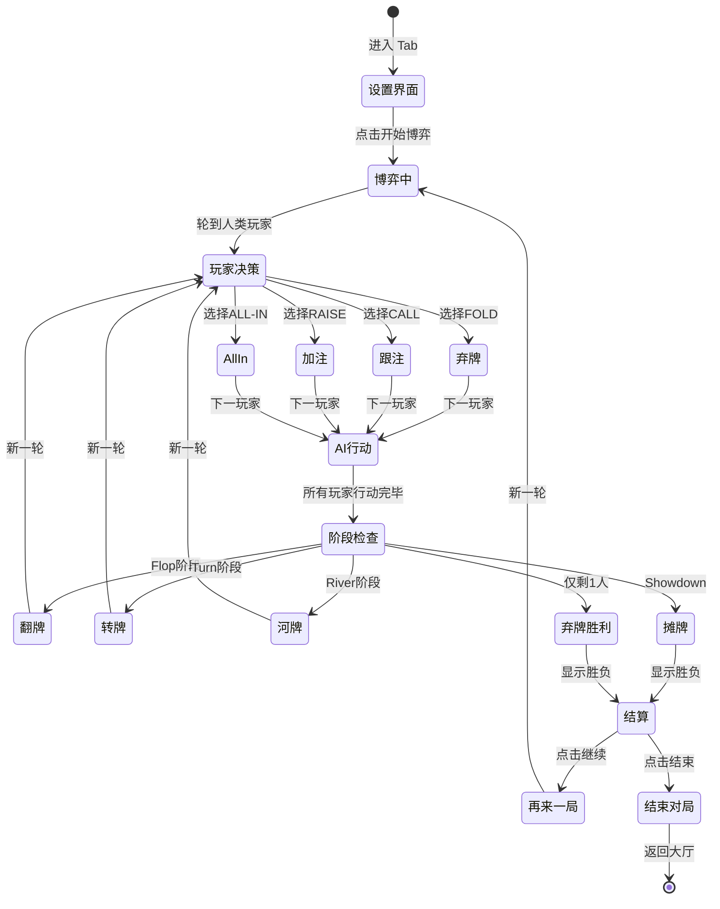
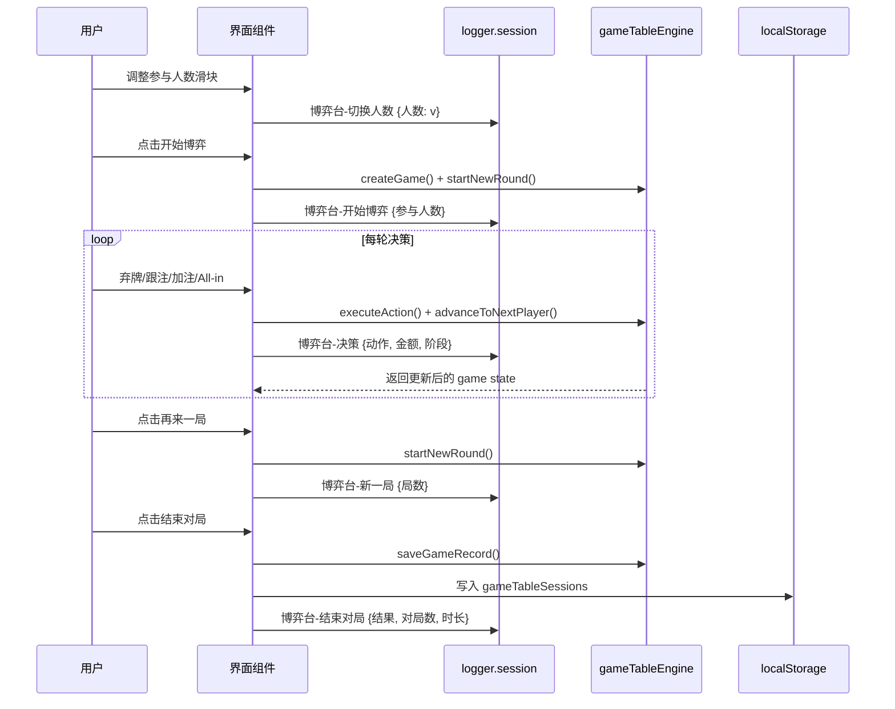
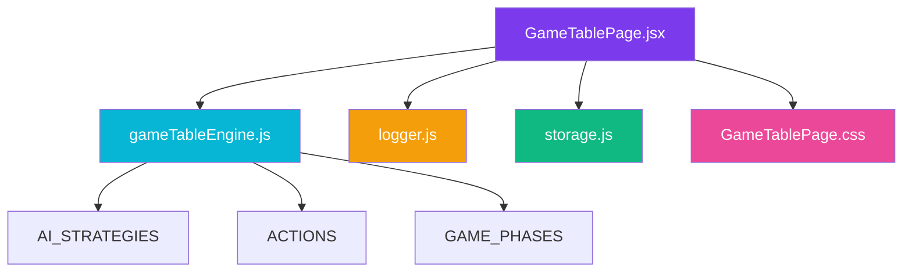

# 模拟博弈台模块 - 4-Tab 结构文档

> 模块路径：[GameTablePage.jsx](file:///e:/poker-egg-fullstack/frontend/src/pages/GameTablePage.jsx)
> 样式文件：[GameTablePage.css](file:///e:/poker-egg-fullstack/frontend/src/pages/GameTablePage.css)
> 引擎依赖：[gameTableEngine.js](file:///e:/poker-egg-fullstack/frontend/src/utils/gameTableEngine.js)

---

## 一、整体架构

```mermaid
flowchart TB
    subgraph GameTablePage [GameTablePage 主组件]
        direction TB
        State[(useState<br/>activeTab: 'lobby')]
        
        Lobby[renderLobby()<br/>入口大厅]
        Trainer[GameTableTrainer<br/>博弈对战]
        Stats[renderStats()<br/>数据统计]
        Behavior[renderBehavior()<br/>行为采集]
        
        State -->|Tab=lobby| Lobby
        State -->|Tab=trainer| Trainer
        State -->|Tab=stats| Stats
        State -->|Tab=behavior| Behavior
    end
    
    subgraph 数据层
        Engine[gameTableEngine]
        Storage[(localStorage<br/>gameTableSessions)]
        Logger[logger.session]
    end
    
    Trainer -->|调用| Engine
    Trainer -->|记录| Logger
    Stats -->|读取| Engine
    Stats -->|读取| Storage
    Behavior -->|读取| Engine
    
    style GameTablePage fill:#1e1340,color:#fff,stroke:#7c3aed
    style Lobby fill:#ec4899,color:#fff
    style Trainer fill:#8b5cf6,color:#fff
    style Stats fill:#06b6d4,color:#fff
    style Behavior fill:#10b981,color:#fff
```

---

## 二、组件结构与数据流



---

## 三、博弈对战流程



---

## 四、日志事件流



---

## 五、4-Tab 代码结构速览

### 5.1 主组件骨架
```javascript
const GameTablePage = () => {
  const [activeTab, setActiveTab] = useState('lobby');

  return (
    <div className="gametable-page">
      {/* 页面标题栏 */}
      <div className="gametable-page-header">...</div>

      {/* Tab 导航 */}
      <Tabs activeKey={activeTab} onChange={setActiveTab} items={[
        { key: 'lobby',    label: '🎮 入口大厅' },
        { key: 'trainer',  label: '⚡ 博弈对战' },
        { key: 'stats',    label: '📊 数据统计' },
        { key: 'behavior', label: '🗄️ 行为采集' },
      ]} />

      {/* Tab 内容 */}
      {activeTab === 'lobby'    && renderLobby()}
      {activeTab === 'trainer'  && <GameTableTrainer />}
      {activeTab === 'stats'    && renderStats()}
      {activeTab === 'behavior' && renderBehavior()}
    </div>
  );
};
```

### 5.2 Tab 内容对照表

| Tab Key | 渲染方式 | 核心数据来源 | 主要组件 |
|---------|---------|-------------|---------|
| `lobby` | 纯函数 `renderLobby()` | `gameTableEngine.analyzeGameBehavior()` | 英雄卡 + 统计卡 + 数据类型卡 |
| `trainer` | 组件 `GameTableTrainer` | `gameTableEngine` 全部 API | PlayerCard / CommunityCards / OppAnalysisPanel / ActionLog |
| `stats` | 纯函数 `renderStats()` | Engine + `storage.get('gameTableSessions')` | 总览卡 + 核心指标 + 行为标签 + 历史记录 |
| `behavior` | 纯函数 `renderBehavior()` | `COLLECTED_DATA_TYPES` 常量 | 样本统计 + 数据详解 + 使用流程 + 隐私说明 |

### 5.3 常量定义

```javascript
// 8 项行为采集数据维度
const COLLECTED_DATA_TYPES = [
  { key: 'opponentModeling',    icon: '🎭', title: '对手建模能力', desc: '...' },
  { key: 'strategyAdaptability', icon: '🔄', title: '策略切换频率', desc: '...' },
  { key: 'coopCompetition',     icon: '🤝', title: '协作/竞争倾向', desc: '...' },
  { key: 'dynamicRisk',          icon: '⚖️', title: '动态风险偏好', desc: '...' },
  { key: 'gameResult',           icon: '🏆', title: '博弈结果',     desc: '...' },
  { key: 'decisionTime',         icon: '⏱️', title: '决策耗时',     desc: '...' },
  { key: 'foldRate',             icon: '🗂️', title: '弃牌率',       desc: '...' },
  { key: 'bluffFrequency',       icon: '🎪', title: '诈唬频率',     desc: '...' },
];
```

---

## 六、日志事件清单

| 事件名 | 触发时机 | 数据字段 |
|-------|---------|---------|
| `博弈台-切换人数` | 调整参与人数滑块 | `{人数: v}` |
| `博弈台-开始博弈` | 点击开始博弈 | `{参与人数: playerCount}` |
| `博弈台-决策` | 每次玩家操作 | `{动作, 金额, 阶段}` |
| `博弈台-新一局` | 点击再来一局 | `{局数: newRound.round}` |
| `博弈台-结束对局` | 点击结束对局 | `{结果, 对局数, 时长}` |

---

## 七、依赖关系



---

## 八、主题色规范

| 用途 | 颜色 |
|-----|------|
| 主渐变 | `#ec4899 → #7c3aed → #06b6d4` |
| Tab 激活背景 | `rgba(236, 72, 153, 0.3) → rgba(139, 92, 246, 0.2)` |
| 英雄卡边框 | `rgba(236, 72, 153, 0.3)` |
| 数据卡 hover | `rgba(236, 72, 153, 0.15)` |
| 流程箭头 | `#ec4899` |
