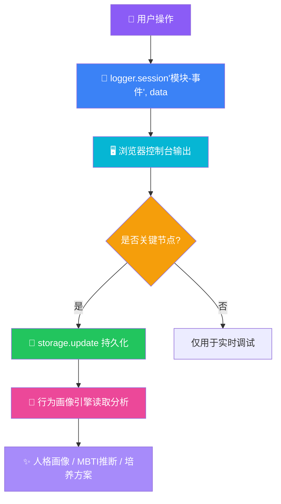
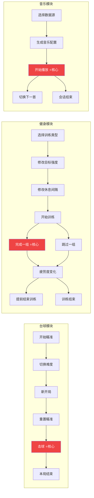
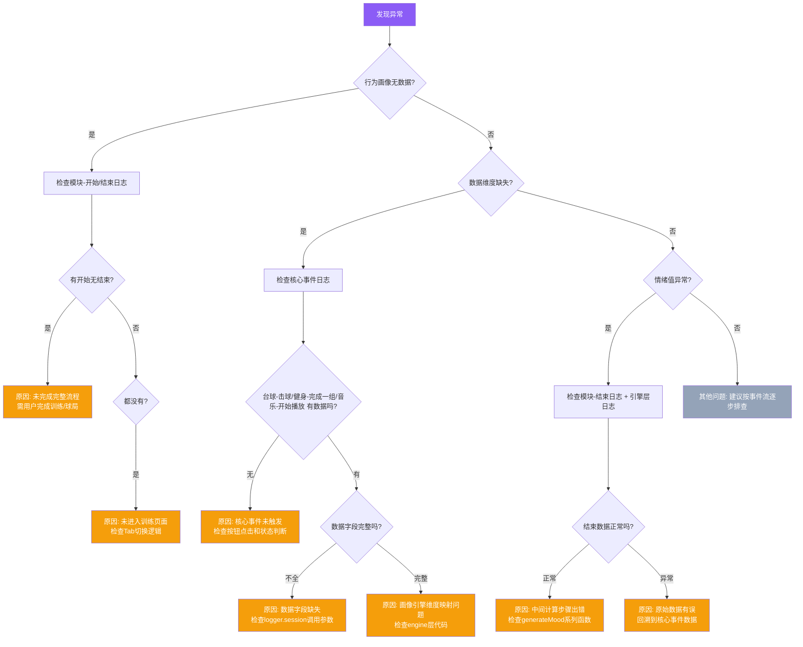

# 行为采集日志规范

> 统一描述台球、健身、音乐三大行为采集模块的日志事件、触发时机与数据格式，便于排查行为采集链路。

---

## 一、日志系统基础

### 1.1 日志输出位置
所有日志通过 `logger.session()` 输出到浏览器控制台，格式为：

```
Y.Mine [SESSION] 2026-08-05 09:56:12.297 台球-开始瞄准 {难度: easy, 剩余目标球: 1, 初始角度: -7.1°}
```

- 前缀标签：`Y.Mine`（紫色背景）
- 分类标识：`[SESSION]`
- 时间戳：精确到毫秒
- 事件名：`模块名-事件名`（如 `台球-击球`）
- 数据对象：可展开查看完整结构

### 1.2 控制台过滤技巧
| 过滤关键词 | 效果 |
|-----------|------|
| `Y.Mine` | 仅显示本系统所有日志 |
| `[SESSION]` | 仅显示会话/行为采集日志 |
| `台球-` / `健身-` / `音乐-` | 仅显示特定模块日志 |

### 1.3 相关文件
- 日志引擎：[logger.js](file:///e:/poker-egg-fullstack/frontend/src/utils/logger.js)
- 台球模块：[BilliardsPage.jsx](file:///e:/poker-egg-fullstack/frontend/src/pages/BilliardsPage.jsx)
- 健身模块：[FitnessPage.jsx](file:///e:/poker-egg-fullstack/frontend/src/pages/FitnessPage.jsx)
- 音乐模块：[MusicPage.jsx](file:///e:/poker-egg-fullstack/frontend/src/pages/MusicPage.jsx)

---

## 二、台球模块日志（7 个事件）

### 2.1 事件总览

| 事件名 | 触发时机 | 数据格式 |
|-------|---------|---------|
| `台球-开始瞄准` | 每次进入瞄准阶段（含新球局和进球后） | `{难度, 剩余目标球, 初始角度}` |
| `台球-切换难度` | 下拉切换难度 | `{新难度}` |
| `台球-新开局` | 点击「新开局」按钮 | `{难度, 目标球数}` |
| `台球-重置瞄准` | 点击「重置瞄准」按钮 | `{重置后角度, 重置后力度}` |
| `台球-击球` | 点击「击球」按钮 | `{角度, 力度, 进球, 折射偏差, 等级}` |
| `台球-本局结束` | 所有球进袋或达到10杆 | `moodData.summary`（字符串） |

### 2.2 事件详解

#### 台球-开始瞄准
```javascript
logger.session('台球-开始瞄准', {
  难度: 'easy',           // 'easy' | 'medium' | 'hard'
  剩余目标球: 1,           // 未进袋的目标球数量
  初始角度: '-7.1°'        // 自动计算的瞄准初始角度
});
```
**排查点**：确认球局初始化后是否正确进入瞄准阶段，难度与目标球数是否匹配。

---

#### 台球-切换难度
```javascript
logger.session('台球-切换难度', {
  新难度: 'medium'         // 'easy' | 'medium' | 'hard'
});
```
**排查点**：确认难度切换是否触发球局重置。

---

#### 台球-新开局
```javascript
logger.session('台球-新开局', {
  难度: 'easy',
  目标球数: 1
});
```
**排查点**：确认状态是否完全重置（击球数、进球数、反馈等）。

---

#### 台球-重置瞄准
```javascript
logger.session('台球-重置瞄准', {
  重置后角度: '-7.1°',
  重置后力度: 50
});
```
**排查点**：确认瞄准参数是否回归默认值。

---

#### 台球-击球
```javascript
logger.session('台球-击球', {
  角度: '-5.3',            // 击球角度（数值，不带°）
  力度: 65,                // 1-100
  进球: 1,                 // 本次击球进球数
  折射偏差: '3.2°',        // 预期与实际折射角度差
  等级: '精准'             // '精准' | '偏差' | '失控'
});
```
**排查点**：
- 核心行为数据入口，确认角度/力度是否正确传递
- `折射偏差` 和 `等级` 是行为画像的关键指标

---

#### 台球-本局结束
```javascript
logger.session('台球-本局结束', 
  '10杆进球5颗，情绪稳定，空间预判精准'  // 自然语言摘要
);
```
**排查点**：确认情绪摘要与实际击球数据是否一致。

---

### 2.3 引擎层日志（补充）
台球引擎还会输出以下日志（来自 [billiardsEngine.js](file:///e:/poker-egg-fullstack/frontend/src/utils/billiardsEngine.js)）：

| 事件名 | 触发时机 |
|-------|---------|
| `生成球局` | `generateRack()` 被调用时 |
| `台球心情盘生成` | `generateBilliardsMood()` 被调用时 |

---

## 三、健身模块日志（11 个事件）

### 3.1 事件总览

| 事件名 | 触发时机 | 数据格式 |
|-------|---------|---------|
| `健身-选择训练类型` | 点击训练类型卡片 | `TRAINING_TYPES[key].label`（字符串） |
| `健身-修改目标强度` | 拖动目标强度滑块 | `{原强度, 新强度}` |
| `健身-修改休息间隔` | 拖动休息间隔滑块 | `{原间隔, 新间隔}` |
| `健身-开始训练` | 点击「开始训练」 | `{类型, 总组数}` |
| `健身-完成一组` | 点击「完成本组」 | `{动作, 第几组, 计划次数, 实际次数, 计划重量, 实际重量, 进度}` |
| `健身-跳过一组` | 点击「跳过本组」 | `{动作, 第几组}` |
| `健身-疲劳度变化` | 切换疲劳度单选 | `{原状态, 新状态}` |
| `健身-提前结束训练` | 点击「结束训练」 | `{已完成, 进度}` |
| `健身-训练结束` | 所有组完成或提前结束 | `{完成率, 偏离类型, 标签}` |

### 3.2 事件详解

#### 健身-选择训练类型
```javascript
logger.session('健身-选择训练类型', '力量增肌');
// 可选值: '力量增肌' | '燃脂塑形' | 'HIIT间歇' | '拉伸恢复'
```
**排查点**：确认训练计划是否根据类型正确生成。

---

#### 健身-修改目标强度
```javascript
logger.session('健身-修改目标强度', {
  原强度: '70%',
  新强度: '85%'
});
```
**排查点**：每次修改会增加 `planModifications` 计数，用于后续偏离分析。

---

#### 健身-修改休息间隔
```javascript
logger.session('健身-修改休息间隔', {
  原间隔: '60秒',
  新间隔: '90秒'
});
```

---

#### 健身-开始训练
```javascript
logger.session('健身-开始训练', {
  类型: 'strength',         // 'strength' | 'fatburn' | 'hiit' | 'stretch'
  总组数: 12
});
```
**排查点**：确认 `execution` 状态是否正确初始化。

---

#### 健身-完成一组
```javascript
logger.session('健身-完成一组', {
  动作: '杠铃深蹲',
  第几组: '2/4',            // 当前组/总组数
  计划次数: 12,
  实际次数: 10,
  计划重量: '60kg',
  实际重量: '55kg',
  进度: '5/12'              // 已完成组/总组
});
```
**排查点**：
- 核心行为数据入口，确认计划与实际的差异
- 差异部分会触发 `planModifications` 计数增加

---

#### 健身-跳过一组
```javascript
logger.session('健身-跳过一组', {
  动作: '杠铃深蹲',
  第几组: '3/4'
});
```
**排查点**：跳过会自动调用「完成一组」（次数记为0），并增加 `planModifications`。

---

#### 健身-疲劳度变化
```javascript
logger.session('健身-疲劳度变化', {
  原状态: '轻松',
  新状态: '疲劳'
});
// 可选值: '轻松' | '一般' | '疲劳' | '力竭'
```
**排查点**：用户自我报告的疲劳度，用于后续情绪画像生成。

---

#### 健身-提前结束训练
```javascript
logger.session('健身-提前结束训练', {
  已完成: '5/12 组',
  进度: '42%'
});
```
**排查点**：确认 `early` 标记是否正确传递给 `finishSession()`。

---

#### 健身-训练结束
```javascript
logger.session('健身-训练结束', {
  完成率: '85%',
  偏离类型: 'reduced_intensity',  // 'none' | 'early_end' | 'reduced_intensity' | 'extended' | 'increased_intensity'
  标签: '稳定执行者'
});
```
**排查点**：
- 完成率和偏离类型是行为画像的核心指标
- `标签` 由 `generateDeviationTag()` 生成，映射人格维度

---

## 四、音乐模块日志（5 个事件）

### 4.1 事件总览

| 事件名 | 触发时机 | 数据格式 |
|-------|---------|---------|
| `音乐-选择数据源` | 点击数据源卡片 | `data.source`（字符串） |
| `音乐-生成音乐配置` | 点击「生成音乐」 | `{BPM, 风格, 行业}` |
| `音乐-开始播放` | 点击「播放」 | `{总音符, BPM}` |
| `音乐-切换下一首` | 点击「下一首」 | （无数据） |
| `音乐-会话结束` | 播放完成或手动结束 | `{时长, 风格}` |

### 4.2 事件详解

#### 音乐-选择数据源
```javascript
logger.session('音乐-选择数据源', '随机生成');
// 可选值: '随机生成' | '德州历史 X 场' | '台球历史 X 场'
```
**排查点**：确认 K 线数据是否根据数据源正确生成。

---

#### 音乐-生成音乐配置
```javascript
logger.session('音乐-生成音乐配置', {
  BPM: 92,
  风格: '专注高效',         // '宁静冥想' | '专注高效' | '活力满满' | '紧张刺激'
  行业: 'tech'              // 'tech' | 'consumer' | 'energy' | 'finance'
});
```
**排查点**：确认 BPM 是否在所选风格的 BPM 范围内。

---

#### 音乐-开始播放
```javascript
logger.session('音乐-开始播放', {
  总音符: 120,
  BPM: 92
});
```
**排查点**：确认 `musicEngine.play()` 是否正确返回结果。

---

#### 音乐-切换下一首
```javascript
logger.session('音乐-切换下一首');
```
**排查点**：切换行为会影响「跳过率」指标计算。

---

#### 音乐-会话结束
```javascript
logger.session('音乐-会话结束', {
  时长: '180秒',
  风格: 'focus'              // 'calm' | 'focus' | 'energetic' | 'intense'
});
```
**排查点**：
- 播放时长与注意力集中度相关
- 会话数据会存入 `musicSessions`

---

## 五、日志事件排查流程图

### 5.1 主数据流



### 5.2 三大模块事件流



> ⭐ 标记为各模块的**核心行为采集点**，是行为画像数据的主要来源。

### 5.3 常见问题排查决策树



### 5.4 排查场景对照表

| 问题 | 检查日志 | 可能原因 |
|-----|---------|---------|
| 行为画像无数据 | `模块-开始` / `模块-结束` 系列 | 未完成完整流程 |
| 数据维度缺失 | 对应子事件（如 `台球-击球`、`健身-完成一组`） | 事件未触发或数据字段不全 |
| 情绪值异常 | `模块-结束` 事件 + 引擎层日志 | 中间计算步骤出错 |

---

## 六、日志命名约定（新增事件时参考）

### 6.1 命名规则
```
{模块名}-{动作描述}
```

- **模块名**：`台球` / `健身` / `音乐` / `调酒` 等（与页面名一致）
- **动作描述**：动词开头，简洁明了（如 `开始瞄准`、`完成一组`、`选择数据源`）

### 6.2 数据格式约定
- 优先使用**对象**而非字符串，便于后续结构化分析
- 字段名使用**中文**（与 UI 展示一致），降低理解成本
- 单位直接写在值里（如 `'7.1°'`、`'60kg'`、`'180秒'`），避免歧义
- 枚举值统一使用英文 key 存储，但日志展示可用中文 label
